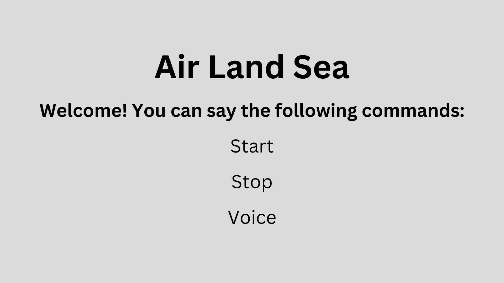

# Air Land Sea Assistant


## Setup
### PC instructions
1. Download and extract zip file from the [Releases page](https://github.com/maxkung101/airLandAndSea/releases).
2. Download vosk-model-small-en-us-0.15 from [https://alphacephei.com/vosk/models](https://alphacephei.com/vosk/models).
3. Move extracted vosk-model-small-en-us-0.15 folder to airLandAndSea directory.
4. Transfer airLandAndSea directory to raspberry pi.

### Install your dependencies
1. On raspberry pi, make sure you have espeak installed.
```
$ sudo apt-get install -y espeak
```
2. Navigate to the folder for the repository
```
$ cd airLandAndSea/
```
3. Install all requirements
```
$ pip install -r requirements.txt
```

## How to use
### Run software
To run, type in the following command while in the repository folder.
```
$ python main.py
```

## About
### Credits
Programmed by Max Kung